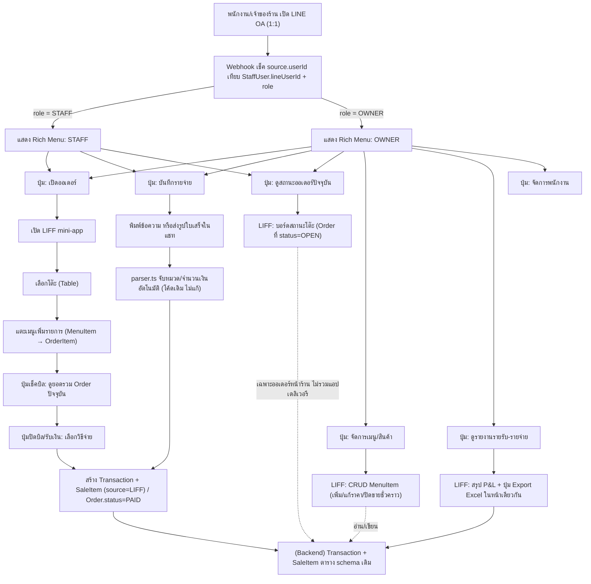

# FlowBook — สรุปธุรกิจและสเปกระบบ LINE OA (ฉบับสมบูรณ์)

**สถานะเอกสาร:** ฉบับสรุปการตัดสินใจล่าสุด (rolling spec) — ใช้แทนสมมติฐานเดิมในส่วนที่ขัดกัน
**จุดประสงค์:** เอกสารนี้เขียนไว้ให้ทั้งทีมและ AI/เครื่องมือที่มาช่วยพัฒนาต่อ อ่านแล้วเข้าใจภาพรวมธุรกิจ + ต่อยอดเขียนโค้ดได้ทันทีโดยไม่ต้องถามย้อนกลับว่า "ทำไมถึงออกแบบแบบนี้"
**Repo อ้างอิง:** github.com/KanthiPhoosorn/FlowBook (branch main ขณะเขียนเอกสารนี้)

---

## 1. ภาพรวมธุรกิจ

### 1.1 ปัญหา (Problem)
ร้านอาหาร/ร้านค้าขนาดเล็กในไทยมีข้อมูลการเงินแยกเป็น 2 ฝั่งที่ไม่เชื่อมกัน:
- **ฝั่งรายรับ** — อยู่ในเครื่อง POS (ถ้ามี) หรือไม่มีระบบบันทึกเลย
- **ฝั่งรายจ่าย** — จดมือ/ไม่จด เพราะการจ่ายเงินเกิดนอกระบบ POS เสมอ (ซื้อวัตถุดิบตลาดเช้า จ่ายค่าเช่า ค่าน้ำค่าไฟ)

ผลคือเจ้าของร้านไม่รู้ "กำไรสุทธิจริง" และไม่มีเอกสารทางการเงินที่เป็นระบบพอจะยื่นขอสินเชื่อธนาคารได้

### 1.2 กลุ่มเป้าหมาย (ICP) — นิยามล่าสุด
> ร้านที่มี **ช่องขายดิจิทัลอย่างน้อย 1 ทาง** และมี **คนเกี่ยวข้องกับเงินมากกว่า 1 คน** (เจ้าของ + ลูกจ้างอย่างน้อย 1 คน)

"ช่องขายดิจิทัล" นับรวม 3 แบบ ไม่จำเป็นต้องเป็นเครื่อง POS จริง:
1. มีเครื่อง POS อยู่แล้ว (FoodStory, POSPOS, Loyverse ฯลฯ)
2. ขายผ่านแอพเดลิเวอรี (Grab, LINE MAN, Foodpanda)
3. ขายออนไลน์ (Shopee, Lazada, เพจ Facebook)

**เกณฑ์คัดร้าน pilot (เฟส 1):** ร้านที่ผ่านนิยามข้างบน + เจ้าของยินดีให้ทดลองใช้ฟรี 30 วัน

**ร้านที่ไม่เข้า ICP โดยตั้งใจ:** แผงลอย/ร้านเจ้าของคนเดียว เก็บเงินสดอย่างเดียว ไม่มีลูกจ้าง ไม่ขายช่องทางดิจิทัลใดเลย — กลุ่มนี้คือตลาดของ "ป้านวล" (ดูหัวข้อ 1.4) ไม่ใช่ FlowBook

### 1.3 คุณค่าหลัก (Core Value Proposition)
1. พนักงานบันทึกขาย+รายจ่ายผ่าน LINE ที่เปิดอยู่ทั้งวันอยู่แล้ว ไม่ต้องโหลดแอพใหม่
2. เจ้าของร้านเห็นกำไรสุทธิจริงแบบเรียลไทม์ ไม่ต้องรอนักบัญชีปิดงบสิ้นเดือน
3. Export เป็นงบกำไรขาดทุน/เอกสารภาษีที่ใช้ยื่นกู้ธนาคารได้จริง

### 1.4 Positioning เทียบคู่แข่ง (ข้อเท็จจริงที่ตรวจสอบแล้ว)

| | ป้านวล | FlowAccount / PEAK | **FlowBook** |
|---|---|---|---|
| ตลาด | บุคคล (personal finance) ไม่ใช่ร้านค้า | ธุรกิจ/SME เต็มรูปแบบ | ร้านค้ารายย่อยที่ "โตเกินป้านวล แต่ยังไม่กล้าเปิดแอพบัญชี" |
| เชื่อม POS/เดลิเวอรี | ไม่มี | **มีแล้ว** (FoodStory, Grab, LINE MAN, Shopee) | มี (ขอบเขตเล็กกว่า ทำ MVP ก่อน) |
| รู้สึกเหมือนเปิด "ซอฟต์แวร์บัญชี" ไหม | ไม่เลย (แชทเพื่อน) | ใช่ — ต้องเปิดแอพ/เว็บแยก เรียนรู้เมนู | ไม่ — อยู่ใน LINE ตลอด ไม่มีแอพแยก |
| ราคา | ฟรี | ฟรี | ยังไม่สรุป (รออีก 1-2 สัปดาห์) |

**ข้อควรระวังเวลา pitch:** ห้ามอ้างว่า "ไม่มีใครเชื่อม POS+รายจ่าย+P&L ให้ร้านอาหาร" เพราะ FlowAccount ทำไปแล้วและฟรี จุดต่างที่จริงคือ **UX/ความฝืดในการใช้งาน** (ไม่ต้องเปิดแอพแยกเลย) ไม่ใช่ฟีเจอร์ที่ขาดหาย

### 1.5 โมเดลธุรกิจ (Business Model)
- **ระยะสั้น (Phase 1):** ฟรี ทดลองกับร้าน pilot 3-5 ร้าน 30 วัน เก็บ traction data
- **ราคา/Pricing:** ยังไม่สรุป — รอทีมประชุมตัดสินใจอีก 1-2 สัปดาห์ (อย่าฟิกซ์ใน implementation)
- **ระยะยาว (North star ไม่ใช่ milestone ทันที):** B2B2G — ใช้ traction data ไปเสนอธนาคารรัฐ (เช่น GSB) เป็นเครื่องมือ "ข้อมูลสนับสนุนการพิจารณาสินเชื่อ" (ไม่ใช่ "ระบบให้คะแนนเครดิต" — ใช้คำนี้ระมัดระวัง เพราะ credit scoring โดยตรงอาจเข้าเกณฑ์กำกับของ ธปท.)
- เตรียม pitch ผ่านโครงการ Startup League (BBH และโครงการอื่นๆ ที่ทีมจะเข้าร่วม)

### 1.6 แผนการดำเนินงาน 3 เฟส (คงเดิมจาก README หลัก)
1. **MVP & Traction Validation** — ร้าน pilot 3-5 ร้าน ฟรี 30 วัน วัด retention + ความแม่นยำ parser
2. **Corporate Formation & PDPA** — จัดตั้งบริษัท + นโยบายข้อมูลส่วนบุคคล
3. **Commercial Launch & Partnership** — ขายตรง SME ก่อน, ค่อยเจรจาพาร์ทเนอร์สถาบันการเงิน (เริ่มจากที่ดีลเร็วกว่า ก่อนค่อยขยับไปธนาคารรัฐ)

**ลำดับพาร์ทเนอร์ที่ควรไล่ตาม (เรียงจากเข้าถึงง่ายสุด → ยากสุด):**
1. เครือข่ายมหาวิทยาลัย/Incubator ที่มีอยู่แล้ว (เช่น BBH) — ใกล้ตัวสุด ใช้หาร้าน pilot + เครดิตความน่าเชื่อถือ
2. สมาคม/ชมรมผู้ประกอบการร้านอาหารท้องถิ่น — เข้าถึงร้านจำนวนมากพร้อมกัน ไม่ต้อง cold outreach ทีละร้าน
3. สำนักงานบัญชี/นักบัญชีอิสระที่ดูแลร้านอาหารขนาดเล็ก — เขาอยากได้ตัวเลขสะอาดจากร้านอยู่แล้ว เป็น win-win ชัด
4. ผู้ให้บริการ POS ขนาดเล็ก/กลาง (ไม่ใช่เจ้าตลาด) — เสนอเป็นพาร์ทเนอร์เสริมฝั่งบัญชี/ภาษีที่เขาไม่มี ไม่ใช่คู่แข่ง
5. สถาบันการเงินที่ไม่ใช่ธนาคารรัฐ (Non-bank lender, Fintech ปล่อยกู้ SME) — ดีลเร็วกว่าธนาคารรัฐมาก เหมาะเป็นพาร์ทเนอร์การเงินก้อนแรก
6. ธนาคารพาณิชย์ระดับกลางที่มีโปรแกรม SME คล่องตัว — ก่อนกระโดดไปธนาคารรัฐ
7. ธนาคารรัฐ (GSB ฯลฯ) — เป้าหมายปลายทาง (north star) ไม่ใช่ milestone เร็วๆนี้

---

## 2. หลักการออกแบบระบบ (Design Principles)

ทุกการตัดสินใจของระบบยึดหลัก 5 ข้อนี้ — ถ้าจะเพิ่มฟีเจอร์ใหม่ ให้เช็คกับหลักการนี้ก่อน:

1. **ไม่สร้าง POS ฮาร์ดแวร์แข่งกับเจ้าตลาด** — POSPOS/Loyverse/FoodStory ใช้เวลาเป็นปีสร้างเรื่อง printer/offline-mode/payment-gateway ทีม 2 คนแข่งไม่ได้และไม่ควรลงแรงที่นี่
2. **ไม่มีแอพแยก — ทุกอย่างอยู่ใน LINE OA เดียว** ทั้งฝั่งพนักงานและเจ้าของร้าน เพื่อรักษาจุดขาย "ไม่ต้องเปิดแอพ" — **ยืนยัน: ใช้ LINE OA ตัวเดียวต่อร้าน ไม่แยกเป็น 2 บอท** แยกสิทธิ์ด้วย `StaffUser.role` + per-user Rich Menu เท่านั้น (เหตุผลเดียวที่ค่อยพิจารณาแยกในอนาคต: โควต้าข้อความ LINE OA ฟรีไม่พอ — ไม่ใช่ตอนนี้)
3. **พนักงานรับออเดอร์แทนลูกค้า ไม่ใช่ลูกค้าสั่งเอง** — ลดความเสี่ยง UX พังกลางมื้ออาหาร และรักษาคุณภาพบริการ (พนักงานแนะนำเมนู/ปรับออเดอร์หน้างานได้)
4. **Reuse backend เดิมเสมอ** — `Transaction` + `SaleItem` ที่มีอยู่แล้วคือปลายทางของทุก flow ใหม่ ไม่สร้างระบบข้อมูลคู่ขนาน
5. **แยกสิทธิ์ตาม role ที่ระดับ UI ด้วย ไม่ใช่แค่ใน backend** — ใช้ per-user Rich Menu ซ่อนปุ่มที่ STAFF ไม่ควรเห็นไปเลย (ไม่ใช่แค่เช็ค permission หลังกดแล้ว)

---

## 3. Schema ที่ต้องเพิ่มจากของเดิม

Schema เดิม (`backend/prisma/schema.prisma`) มี `Shop`, `StaffUser`, `Category`, `PaymentMethod`, `Transaction`, `SaleItem`, `Attachment`, `Budget`, `AutoLogRule` อยู่แล้ว — **ห้ามแก้โครงสร้างเดิม** ส่วนที่ต้องเพิ่มสำหรับฟีเจอร์ "เปิดออเดอร์ตามโต๊ะ" มีดังนี้:

```prisma
// ฟีเจอร์ใหม่: เปิดออเดอร์ตามโต๊ะ ผ่าน LIFF — ต่อยอดจาก Transaction/SaleItem เดิม
// money convention เดิมยังใช้ต่อ: ทุกราคาเก็บเป็นสตางค์ (Int) ผ่าน src/lib/money.ts

model Table {
  id        String   @id @default(cuid())
  shopId    String
  shop      Shop     @relation(fields: [shopId], references: [id], onDelete: Cascade)
  label     String   // เช่น "โต๊ะ 1", "A3" — ร้านตั้งชื่อเองได้
  status    String   @default("AVAILABLE") // AVAILABLE | OCCUPIED
  orders    Order[]

  @@unique([shopId, label])
  @@index([shopId])
}

model MenuItem {
  id        String   @id @default(cuid())
  shopId    String
  shop      Shop     @relation(fields: [shopId], references: [id], onDelete: Cascade)
  name      String
  price     Int      // สตางค์ — toSatang()/toBaht() จาก src/lib/money.ts
  category  String?  // กลุ่มเมนู เช่น "อาหารจานเดียว", "เครื่องดื่ม" (แสดงผลเท่านั้น ไม่ใช่ Category บัญชี)
  active    Boolean  @default(true)
  orderItems OrderItem[]

  @@index([shopId])
}

model Order {
  id          String      @id @default(cuid())
  shopId      String
  shop        Shop        @relation(fields: [shopId], references: [id], onDelete: Cascade)
  tableId     String
  table       Table       @relation(fields: [tableId], references: [id])
  status      String      @default("OPEN") // OPEN | PAID | CANCELLED
  openedById  String?     // StaffUser.id ของคนเปิดออเดอร์
  items       OrderItem[]
  transactionId String?   // ผูกกับ Transaction ที่สร้างตอนปิดบิล (settle)
  createdAt   DateTime    @default(now())
  closedAt    DateTime?

  @@index([shopId, status])
}

model OrderItem {
  id         String    @id @default(cuid())
  orderId    String
  order      Order     @relation(fields: [orderId], references: [id], onDelete: Cascade)
  menuItemId String
  menuItem   MenuItem  @relation(fields: [menuItemId], references: [id])
  qty        Int       @default(1)
  unitPrice  Int       // สตางค์ ณ ตอนสั่ง (เผื่อราคาเมนูเปลี่ยนทีหลัง ไม่กระทบบิลเก่า)
  note       String?   // เช่น "ไม่เผ็ด", "เพิ่มไข่ดาว"

  @@index([orderId])
}
```

**Flow การแปลงข้อมูล (สำคัญ):** เมื่อพนักงานกด "ปิดบิล/รับเงิน" ใน LIFF → ระบบสร้าง `Transaction` (type=INCOME, source="LIFF") + `SaleItem` หลายรายการ (1 รายการต่อ `OrderItem`) จาก `Order` ที่ปิดแล้ว → set `Order.status = "PAID"` + `Order.transactionId` ชี้กลับมาที่ Transaction ที่สร้าง — **schema เดิมไม่ต้องแก้อะไรเลย** เป็นแค่ชั้นบนที่แปลงข้อมูลลงไปเฉยๆ

---

## 4. Workflow ระบบ LINE OA — ภาพรวม



### 4.1 ตารางสรุปปุ่ม Rich Menu

| ปุ่ม | Role ที่เห็น | กดแล้วไปไหน | Action/Endpoint |
|---|---|---|---|
| เปิดออเดอร์ | STAFF, OWNER | เปิด LIFF mini-app | `GET liff://<liffId-order>?shopId=...` |
| บันทึกรายจ่าย | STAFF, OWNER | ส่งข้อความ/รูป กลับมาในแชทเดิม | `POST /api/shops/:shopId/transactions/parse` แล้ว `.../upload` |
| ดูสถานะออเดอร์ปัจจุบัน | STAFF, OWNER | เปิด LIFF (บอร์ดสถานะโต๊ะ) | `GET /api/shops/:shopId/orders?status=OPEN` (ใหม่ — ดูหัวข้อ 4.4) |
| จัดการเมนู/สินค้า | OWNER เท่านั้น | เปิด LIFF (CRUD MenuItem) | `GET/POST/PATCH /api/shops/:shopId/menu-items` (ใหม่) |
| ดูรายงานรายรับ-รายจ่าย | OWNER เท่านั้น | เปิด LIFF (สรุป P&L + ปุ่ม Export อยู่ในหน้านี้) | `GET /api/shops/:shopId/reports/pl` + `GET .../export/xlsx` (ปุ่ม Export ฝังอยู่ในหน้าเดียวกัน ไม่ใช่ Rich Menu แยก) |
| จัดการพนักงาน | OWNER เท่านั้น | เปิด LIFF หน้าตั้งค่า (แยกจากหน้าออเดอร์) | ยังไม่ implement — เพิ่มใน backlog |

**หมายเหตุการเปลี่ยนแปลง:** เดิมมีปุ่ม "Export ยื่นกู้แบงค์" แยกออกมาบน Rich Menu — ยกเลิกแล้ว ย้ายเข้าไปเป็นปุ่มภายในหน้า "ดูรายงานรายรับ-รายจ่าย" แทน เพื่อลดจำนวนปุ่มบน Rich Menu (LINE จำกัดพื้นที่ปุ่มมาตรฐานไว้ที่ 6 ช่อง — OWNER ตอนนี้ใช้ไป 6 ช่องเต็มแล้ว ถ้าจะเพิ่มปุ่มอีกในอนาคตต้องใช้ rich menu alias/tab-switching ของ LINE)

### 4.2 รายละเอียด Flow ที่ 1 — เปิดออเดอร์ (LIFF)
1. พนักงานแตะปุ่ม "เปิดออเดอร์" บน Rich Menu → LIFF เปิดขึ้นมาทับหน้าแชท (ไม่ออกจาก LINE)
2. LIFF ดึง `lineUserId` ของพนักงานอัตโนมัติผ่าน LIFF SDK (`liff.getProfile()`) → map กับ `StaffUser` ที่มีอยู่แล้ว ไม่ต้อง login ซ้ำ
3. หน้าจอแรก: กริดปุ่มเลือกโต๊ะ (จาก `Table` ที่ตั้งไว้) — แตะ "เปิดโต๊ะใหม่" ได้ถ้ายังไม่มี `Order` ที่ status=OPEN ของโต๊ะนั้น
4. เลือกโต๊ะแล้ว → กริดปุ่มเมนู (จาก `MenuItem`) แตะเพิ่มรายการเข้า `OrderItem` ของ `Order` นั้นได้เรื่อยๆ (ลูกค้าสั่งเพิ่มกี่ครั้งก็กลับมาแตะเพิ่มได้)
5. ปุ่ม "เช็คบิล" → แสดงรายการ+ยอดรวมปัจจุบันของโต๊ะนั้น
6. ปุ่ม "ปิดบิล/รับเงิน" → เลือกวิธีจ่าย (เงินสด/โอน/บัตร) → ยืนยัน → backend สร้าง `Transaction`+`SaleItem` ตามที่อธิบายในหัวข้อ 3 → `Order.status="PAID"` → โต๊ะกลับเป็น `AVAILABLE`

### 4.3 รายละเอียด Flow ที่ 2 — บันทึกรายจ่าย (ของเดิม ไม่แก้)
1. พนักงานพิมพ์ข้อความ (เช่น "ค่าน้ำแข็ง 50 บาท เงินสด") หรือส่งรูปใบเสร็จเข้าแชทเดิม
2. `parser.ts` จับหมวดหมู่/จำนวนเงิน/วิธีจ่ายอัตโนมัติ (มีเทส 7/7 ผ่านอยู่แล้ว)
3. สร้าง `Transaction` (type=EXPENSE) ทันที — ไม่มีการเปลี่ยนแปลงจากที่ Coder 1 เขียนไว้

### 4.4 รายละเอียด Flow ที่ 4 — ดูสถานะออเดอร์ปัจจุบัน (ใหม่)
1. STAFF หรือ OWNER แตะปุ่ม "ดูสถานะออเดอร์ปัจจุบัน" → เปิด LIFF แสดงบอร์ดสถานะ (คล้ายจอครัวเล็กๆ)
2. ดึง `Order` ทุกตัวที่ `status=OPEN` ของร้านนั้น join กับ `Table` + `OrderItem` มาแสดงเป็นการ์ดต่อโต๊ะ (รายการอาหาร + เวลาที่เปิดมา)
3. ไม่ต้องเพิ่ม schema ใหม่ — query อย่างเดียวจาก `Order`/`Table`/`OrderItem` ที่ออกแบบไว้แล้วในหัวข้อ 3

**ข้อจำกัดที่ต้องรู้ (สำคัญ):** บอร์ดนี้แสดงได้แค่ออเดอร์จากระบบ FlowBook เอง (หน้าร้าน/dine-in) เท่านั้น **ไม่สามารถดึงออเดอร์สดจาก Grab/LINE MAN/Foodpanda มาแสดงรวมในบอร์ดเดียวกันได้** เพราะการดูออเดอร์สดจากแพลตฟอร์มเดลิเวอรีต้องผ่าน Partner API ที่ต้องขอสัญญาความร่วมมือกับแต่ละแพลตฟอร์มโดยตรง (business development ไม่ใช่ engineering task) ร้านที่รับออเดอร์หลายแพลตฟอร์มจริงๆมักใช้แท็บเล็ตแยกของแต่ละแพลตฟอร์มอยู่แล้ว — ข้อมูลจากแพลตฟอร์มเดลิเวอรียังคงเข้าระบบแบบ "สรุปยอดหลังจบวัน/รอบ" เท่านั้น (ตามที่ออกแบบไว้ในกลุ่ม B ของ POS ingestion) ไม่ใช่ออเดอร์สด — เก็บการดึงออเดอร์สดข้ามแพลตฟอร์มไว้เป็น north-star เฟสหลัง ถ้าวันหนึ่งได้ partnership จริงกับแพลตฟอร์มเหล่านั้น

### 4.5 รายละเอียด Flow ที่ 5 — จัดการเมนู/สินค้า (OWNER เท่านั้น, ใหม่)
1. OWNER แตะปุ่ม "จัดการเมนู/สินค้า" → เปิด LIFF แสดงรายการ `MenuItem` ปัจจุบันของร้าน
2. แก้ชื่อ/ราคา/หมวด หรือ toggle `active` (ปิดขายชั่วคราวโดยไม่ต้องลบทิ้ง) หรือเพิ่มรายการใหม่
3. **สำคัญ:** การแก้ราคาใน `MenuItem` จะไม่กระทบบิลที่เปิดอยู่หรือปิดไปแล้ว เพราะ `OrderItem.unitPrice` เก็บราคา ณ ตอนสั่งไว้แยกต่างหาก (immutable snapshot) — ออกแบบไว้รองรับเคสนี้ตั้งแต่หัวข้อ 3 แล้ว ไม่ต้องแก้ schema เพิ่ม

### 4.6 รายละเอียด Flow ที่ 6 — ดูรายงานรายรับ-รายจ่าย (OWNER เท่านั้น, รวม Export ไว้ในหน้าเดียว)
1. OWNER แตะปุ่ม "ดูรายงานรายรับ-รายจ่าย" → เปิด LIFF แสดงสรุป P&L (รายรับ/รายจ่าย/กำไรสุทธิ ตามช่วงเวลาที่เลือก)
2. ภายในหน้าเดียวกันมีปุ่ม **"Export เป็น Excel"** กดแล้วเรียก `GET /api/shops/:shopId/export/xlsx` ดาวน์โหลดไฟล์ที่ใช้ยื่นกู้แบงค์ได้ทันที — ไม่ใช่ปุ่ม Rich Menu แยกอีกต่อไป (เหตุผล: ผู้ใช้มักอยาก "ดูตัวเลขก่อนค่อยตัดสินใจ export" และลดความแน่นของ Rich Menu)
3. **กฎสำคัญที่ยังใช้อยู่:** ปุ่มนี้ตั้งอยู่บน Rich Menu ของ OWNER เท่านั้น (per-user rich menu — STAFF ไม่เห็นปุ่มนี้เลย) เพราะ Rich Menu ผูกกับแชท 1:1 ของแต่ละคนอยู่แล้ว การเปิด LIFF จากปุ่มนี้จึงเกิดในบริบทส่วนตัวของ OWNER โดยอัตโนมัติ — **แต่ถ้าในอนาคตมีการแจ้งเตือน/สรุปอัตโนมัติแบบ push message** (ไม่ใช่กดเปิดจาก Rich Menu) ต้อง push ไปยัง `lineUserId` ของ OWNER ตรงๆเท่านั้น ห้าม push เข้ากลุ่มไลน์ที่มีพนักงานอยู่ด้วยเด็ดขาด เพราะ LINE ไม่มีระบบ "ให้เห็นคนเดียวในกลุ่ม"

---

## 5. Permission Matrix

| การกระทำ | STAFF | OWNER |
|---|---|---|
| บันทึกขาย (เปิดออเดอร์ผ่าน LIFF) | ✓ | ✓ |
| บันทึกรายจ่าย (พิมพ์/ส่งรูปในแชท) | ✓ | ✓ |
| ดูยอดขายวันนี้ (เช็คยอดเงินสด) | ✓ | ✓ |
| ดูงบกำไรขาดทุน / P&L | ✗ | ✓ |
| Export รายงานไปยื่นกู้แบงค์ | ✗ | ✓ |
| แก้/ลบรายการย้อนหลัง | ✗ | ✓ (ควรมี audit log — ดูหัวข้อ 6) |
| เพิ่ม/ลบพนักงาน, ตั้งเมนู/ราคา | ✗ | ✓ |

**วิธี enforce:** สองชั้นซ้อนกัน
1. **ชั้น UI:** ใช้ [per-user rich menu](https://developers.line.biz/en/docs/messaging-api/use-per-user-rich-menus/) ของ LINE — ผูก Rich Menu คนละชุดต่อ `lineUserId` ตาม `StaffUser.role` พนักงานจะไม่เห็นปุ่มที่ตัวเองไม่มีสิทธิ์ใช้เลยตั้งแต่แรก
2. **ชั้น Backend:** ทุก endpoint ที่อ่อนไหว (`reports/*`, `export/*`) ต้องเช็ค `StaffUser.role === "OWNER"` ก่อนตอบเสมอ แม้ฝั่ง UI จะกรองไปแล้วก็ตาม (กัน gap กรณีมี client อื่นมาเรียก API ตรงในอนาคต)

---

## 6. ข้อจำกัดที่รู้อยู่แล้ว (Known Limitations — v1)

ระบุไว้ตรงนี้เพื่อให้ทีม/AI ที่มาต่อยอดไม่ต้อง "เจอเอง" ทีหลัง — เป็นการตัดสินใจที่ยอมรับแล้ว ไม่ใช่บั๊กที่ลืมแก้:

1. **ไม่มี Offline mode** — ถ้าเน็ตร้านหลุดตอนเปิดออเดอร์ผ่าน LIFF จะใช้งานไม่ได้ทันที (ต่างจากเครื่อง POS จริงที่มักมี local cache) ยอมรับเป็นข้อจำกัด v1
2. **ไม่รองรับเครื่อง POS ฮาร์ดแวร์** — ถ้าร้านมี POS อยู่แล้ว (Tier/กลุ่ม B) ให้ใช้วิธี "เชื่อมต่อดึงข้อมูล" จาก POS เดิมในเฟสถัดไป ไม่ใช่สร้าง POS แข่ง — ยังไม่ implement ใน v1
3. **ไม่มีออเดอร์สดจากแพลตฟอร์มเดลิเวอรี** — บอร์ดสถานะออเดอร์ (หัวข้อ 4.4) แสดงได้แค่ออเดอร์หน้าร้าน/dine-in เท่านั้น การดึงออเดอร์สดจาก Grab/LINE MAN/Foodpanda ต้องมี Partner API agreement กับแต่ละแพลตฟอร์มโดยตรง (ดูหัวข้อ 1.6 ลำดับพาร์ทเนอร์) ข้อมูลจากแพลตฟอร์มเดลิเวอรียังคงเข้าระบบแบบสรุปยอดหลังจบรอบเท่านั้น
4. **ยังไม่มี Audit Log** — การแก้/ลบ `Transaction` ตอนนี้ทับข้อมูลเดิมตรงๆ ไม่มีประวัติ ถ้าจะใช้ระบบนี้เป็นหลักฐานยื่นกู้แบงค์จริงจัง ต้องเพิ่ม audit trail ก่อน (แนะนำเป็น priority ถัดจากงานออเดอร์เสร็จ)
5. **เงินทุกจุดเก็บเป็นสตางค์ (Int)** — แก้ไปแล้วในรอบก่อน (`src/lib/money.ts`, `toSatang()`/`toBaht()`) ฟีเจอร์ใหม่ (`MenuItem.price`, `OrderItem.unitPrice`) ต้องเดินตาม convention นี้ ห้ามใช้ Float
6. **`Category.plGroup`** มีแล้วสำหรับจัดกลุ่ม P&L (COGS/PAYROLL/RENT/...) — ฟีเจอร์ใหม่เรื่องเมนู/ออเดอร์ไม่เกี่ยวกับฟิลด์นี้โดยตรง (`MenuItem.category` เป็นแค่หมวดเมนูแสดงผล คนละเรื่องกับ `Category.plGroup` ที่ใช้ทำบัญชี — ห้ามสับสนสองฟิลด์นี้)
7. **ยังไม่มี flow ลงทะเบียนพนักงานใหม่อย่างเป็นทางการ** — ต้องออกแบบเพิ่ม (เช่น เจ้าของแจกรหัสเชิญสั้นๆ พนักงานพิมพ์ครั้งแรกเพื่อสร้าง `StaffUser` role=STAFF)
8. **โควต้าข้อความ LINE OA ฟรี** — ถ้าร้านใหญ่จนข้อความ (แจ้งเตือน+รายจ่าย+รายงาน) รวมกันชนโควต้ารายเดือน ค่อยพิจารณาแยก channel ตอนนั้น ไม่ต้องคิดล่วงหน้าใน v1

---

## 7. Task Breakdown สำหรับทีม (ต่อยอดจาก README เดิม)

แบ่งงานต่อจากโครงสร้าง Coder 1 / Coder 2 เดิมในโปรเจค:

| งาน | เกี่ยวข้องกับ | สถานะ |
|---|---|---|
| `Table`, `Order`, `OrderItem`, `MenuItem` model | schema.prisma | ใหม่ — ยังไม่ทำ |
| Endpoint จัดการเมนู/โต๊ะ (CRUD) | module ใหม่ เช่น `modules/menu.ts`, `modules/tables.ts` | ใหม่ — ยังไม่ทำ |
| Endpoint เปิด/ปิด Order + แปลงเป็น Transaction | module ใหม่ เช่น `modules/orders.ts` | ใหม่ — ยังไม่ทำ |
| Endpoint ดูสถานะออเดอร์ปัจจุบัน (`GET orders?status=OPEN`) | `modules/orders.ts` เดียวกัน | ใหม่ — ยังไม่ทำ |
| LIFF mini-app: เปิดออเดอร์ (เลือกโต๊ะ→เมนู→เช็คบิล→ปิดบิล) | frontend ใหม่ทั้งหมด | ใหม่ — ยังไม่ทำ |
| LIFF mini-app: บอร์ดสถานะออเดอร์ + CRUD เมนู/สินค้า | frontend ใหม่ (ใช้โครง LIFF เดียวกัน คนละหน้า) | ใหม่ — ยังไม่ทำ |
| LIFF mini-app: รายงาน P&L + ปุ่ม Export ในหน้าเดียว | frontend ใหม่ (ใช้โครง LIFF เดียวกัน คนละหน้า) | ใหม่ — ยังไม่ทำ |
| Per-user Rich Menu ตาม role | `line/` (Coder 2 task 8 เดิม ขยายเพิ่ม) | ขยายจาก stub เดิม |
| Flow ลงทะเบียนพนักงานใหม่ (invite code) | `modules/categories.ts`-style module ใหม่ | ใหม่ — ยังไม่ทำ |
| `reports.ts`, `export.ts` (P&L, xlsx) | ของเดิมที่ Coder 2 ค้างไว้ (task 7) | Stub รออยู่แล้ว |
| Audit log สำหรับ Transaction แก้/ลบ | schema + module | Backlog — ทำหลังออเดอร์เสร็จ |

---

*เอกสารนี้สรุปจากบทสนทนาออกแบบระบบระหว่างทีม FlowBook กับ Claude (Anthropic) — ใช้เป็นจุดอ้างอิงร่วม ไม่ใช่ spec ที่ตายตัว ปรับแก้ได้เมื่อมีข้อมูลจริงจากร้าน pilot*

---

## 4. การแบ่งงานทีมและสถานะการพัฒนา MVP (Team Workload & Development Status)

ทีมพัฒนา (Coders) มี **2 คน** แบ่งงานฝั่ง Backend ออกเป็น 2 ส่วนที่ทำขนานกันได้ (Low Coupling) — Coder 1 วางฐานราก (ฐานข้อมูล + ตัวแยกข้อความ + ข้อมูลตั้งต้น) ให้เสร็จก่อน จากนั้น Coder 2 ต่อยอดบนข้อมูลเดโมได้ทันทีโดยไม่บล็อกกัน

| Coder | บทบาท | ขอบเขตงาน | Tasks |
| :--- | :--- | :--- | :--- |
| **Coder 1 — Kanthi Phoosorn** | ฐานราก + โมดูลหลัก | Database schema + seed, ตัวแยกข้อความไทย (Keyword/NLP), ตัวคำนวณรอบงบ/วันที่, โมดูล **Categories / Payment Methods / Transactions** (CRUD + แยกข้อความ + อัปโหลดรูป-เสียง) | **1–5** |
| **Coder 2 — _[ชื่อเพื่อน]_** | งบประมาณ + รายงาน + การเชื่อมต่อภายนอก | **Budgets / Auto-log / Reminders** + Scheduler, **Reports + งบกำไรขาดทุน (P&L)**, **Export** CSV/Excel, **POS** ingestion API, **LINE** webhook | **6–9** |

### รายการงาน Backend (Task Breakdown & Status)

**Coder 1 — Kanthi**
- [x] **1.** วางโครงโปรเจกต์ + ติดตั้ง dependencies
- [x] **2.** พิสูจน์ว่า stack รันได้จริง (Prisma + Express + SQLite vertical slice)
- [x] **3.** Prisma schema เต็มรูปแบบ + seed ข้อมูลภาษาไทย (ร้านเดโม, 14 หมวดหมู่, 4 ช่องทางจ่าย, ธุรกรรมตัวอย่าง, งบ)
- [x] **4.** Core libs: ตัวแยกข้อความไทย (`parser.ts`) + ตัวคำนวณรอบวันที่ (`period.ts`)
- [x] **5.** โมดูล Categories / Payment Methods / Transactions (CRUD + `/parse` + `/upload`)

> ✅ **ส่วนของ Coder 1 (tasks 1–5) เสร็จและทดสอบผ่านแล้ว** — parser 7/7 ผ่าน · smoke test ทุก endpoint ผ่าน

**Coder 2 — _[ชื่อเพื่อน]_**
- [ ] **6.** Budgets + Auto-log (≤ 20 รายการ) + Reminders + Scheduler (node-cron)
- [ ] **7.** Reports (รายเดือน/สัปดาห์/วัน + กราฟ) + P&L กำไรสุทธิ + Export CSV/Excel
- [ ] **8.** POS ingestion (REST API) + LINE webhook (ตรวจ signature + ตอบกลับภาษาไทย)
- [ ] **9.** รวมระบบ + ทดสอบ end-to-end ทั้งหมด + เอกสารสรุป

> 💻 โค้ด Backend (MVP) อยู่ในโฟลเดอร์ **[`/backend`](./backend)** — Stack: **TypeScript · Express · Prisma + SQLite · LINE Messaging API** · วิธีติดตั้งและรันดูที่ **[`backend/README.md`](./backend/README.md)**
